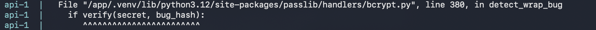
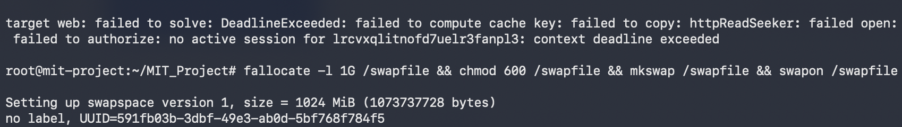
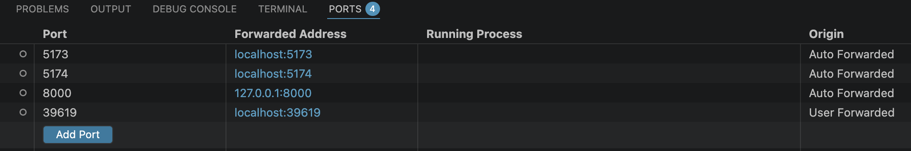
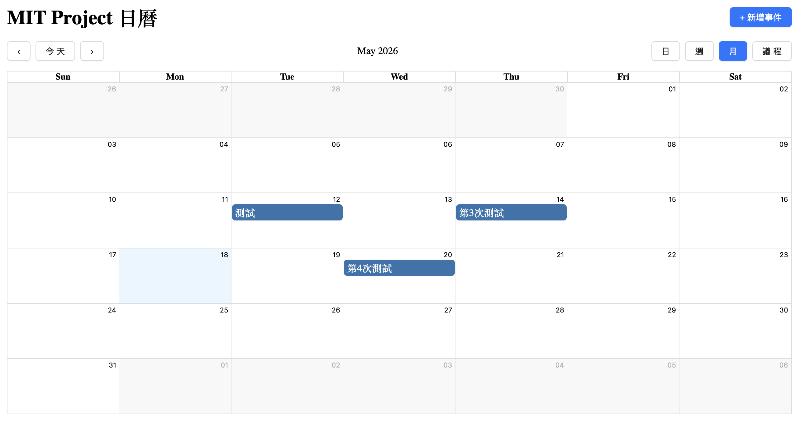
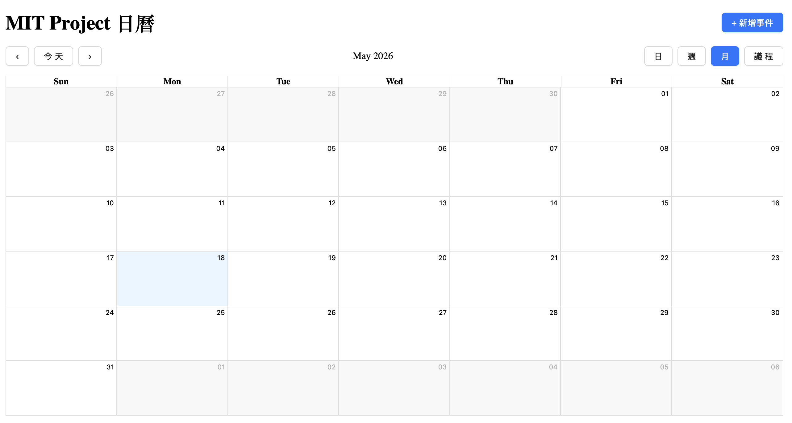
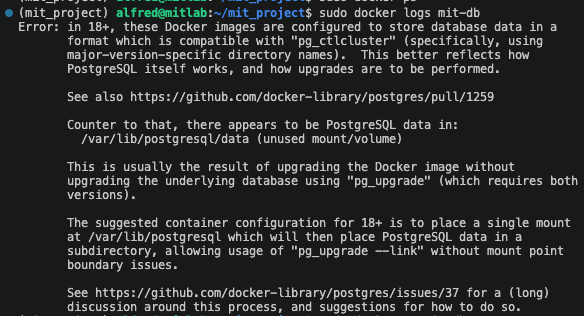
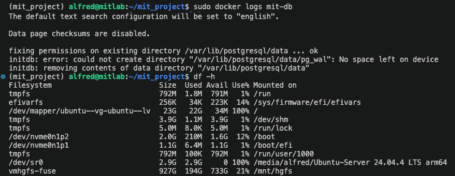
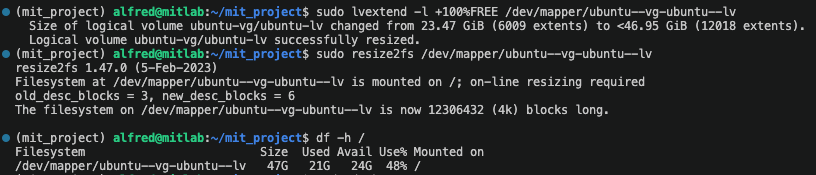
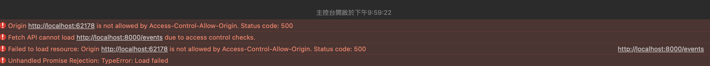
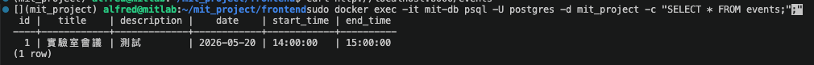

# 前置期日誌（2026-05）：全端基礎

## 專案目標

| 目標 | 狀態 |
|---|---|
| 三層架構（React + FastAPI + PostgreSQL） | ✅ 完成 |
| Docker 容器化 | ✅ 完成 |
| 雲端部署（DigitalOcean Droplet） | ✅ 完成 |
| CI/CD 自動部署（GitHub Actions） | ✅ 完成 |
| 使用者功能 | ✅ 完成 |

---

## 2026-05-29

### 完成項目
- 更換網站 favicon：加入 ChatGPT 生成的完整 favicon pack（多尺寸 PNG + ICO + apple-touch-icon），更新 `index.html` 同時引用多種格式提升跨瀏覽器相容性
- 在 VM 上生成 ed25519 SSH key，加入 GitHub，將 git remote 從 HTTPS 改為 SSH 格式，解決 push 認證問題
- 改善學習日誌結構：新增「今日小結」、「待釐清」章節，新增全局進度表，修合 5/18 重複章節，統一各天章節順序
- 從 Namecheap（GitHub Student Pack）申請免費網域 `mit-project.me`
- 設定 DNS A Record 將 `mit-project.me` 和 `www.mit-project.me` 指向 Droplet IP
- 建立 `frontend/nginx.conf`，設定 ACME 驗證路徑與 HTTP → HTTPS 跳轉
- 更新 `docker-compose.yml`，加入 certbot 服務與兩個 Volume（certbot-www、certbot-certs）
- 成功申請 Let's Encrypt SSL 憑證（有效至 2026-08-26）
- nginx 加入 HTTPS server block，啟用 SSL 憑證
- nginx 加入 `/api/` proxy，讓前端 API 請求走同一個 HTTPS 網域
- 更新 `.env.production`，`VITE_API_URL` 改為 `https://mit-project.me/api`
- 設定 cron job，每天 00:00 和 12:00 自動檢查並續期憑證
- 確認 cron job 正常運作：透過 `grep certbot /var/log/syslog` 驗證 2026-05-29 00:00 UTC 準時執行，certbot 檢查憑證期限後跳過（憑證剩 88 天，未達 30 天續期門檻）

### 遇到的問題

**問題 1：VM 無法 git push 到 GitHub**
- 問題：執行 `git push` 時認證失敗；改用 SSH 後又依序碰到 `Host key verification failed` 和 `Permission denied (publickey)`
- 原因：這台 VM 是新環境，三個問題連環：remote URL 是 HTTPS（需要 PAT）→ 改 SSH 後 known_hosts 沒有 GitHub 指紋 → 指紋加了但本機從未生成過 SSH 金鑰，`~/.ssh/` 沒有私鑰，GitHub 上的公鑰是另一台機器的
- 解決：生成新金鑰（`ssh-keygen -t ed25519`）→ 將公鑰加入 GitHub SSH Keys → `ssh-keyscan github.com >> ~/.ssh/known_hosts` → `git remote set-url origin git@github.com:...`

**問題 2：Let's Encrypt dry-run 回傳 "Service busy; retry later"**
- 問題：第一次執行 dry-run 時收到服務繁忙錯誤，無法完成
- 原因：Let's Encrypt ACME 伺服器有請求頻率限制，偶爾在高峰期暫時拒絕新請求
- 解決：等待 1-2 分鐘後重試，成功通過

**問題 3：HTTPS 設定完成後 Safari 顯示「找不到伺服器」**
- 問題：HTTPS 部署後，Safari 正常視窗無法開啟網站，無痕視窗可以；Chrome 也正常
- 原因：Safari 快取了之前連線失敗的 DNS 狀態，正常視窗讀到舊記錄；無痕視窗沒有快取所以繞過
- 解決：在 Mac 終端機執行 `sudo dscacheutil -flushcache; sudo killall -HUP mDNSResponder` 清除系統 DNS 快取

**問題 4：改為 HTTPS 後登入功能失效**
- 問題：網站改為 HTTPS 後，登入與所有 API 呼叫失敗
- 原因：前端跑在 HTTPS，但 `.env.production` 的 `VITE_API_URL` 仍是 `http://...`；瀏覽器的混合內容政策（Mixed Content Policy）會自動擋掉 HTTPS 頁面發出的 HTTP 請求
- 解決：在 nginx 加入 `/api/` proxy location 讓 API 走同一個 HTTPS 網域；更新 `VITE_API_URL` 為 `https://mit-project.me/api`

### 待辦
- [x] 確認 cron job log（明天 00:00/12:00 後）
- [ ] 設定防火牆，只開放 port 80 和 443（8000 改走 nginx proxy 後可關閉對外）

---

## 2026-05-20

### 完成項目
- 將 CORS `allow_origins` 從寫死的 `"*"` 改為環境變數 `FRONTEND_ORIGIN`，docker-compose.yml 注入 Droplet IP，本地開發自動 fallback 到 localhost:5173
- 建立 .gitignore，排除 `__pycache__/` 和 `.pyc` 檔案
- 設定 Alembic migration 系統，建立三個版本：`create_events_table`、`create_users_table`、`add_user_id_to_events`
- 實作後端使用者認證：`POST /register`（bcrypt hash 密碼）、`POST /login`（回傳 JWT token）
- 所有 events 端點加上 JWT middleware，只能存取自己的資料
- 新增前端登入/註冊頁面（`Login.jsx`），登入後儲存 token 到 localStorage
- 成功部署認證功能到 Droplet，第一個使用者建立成功
- 將 `SECRET_KEY` 等機密從 `docker-compose.yml` 移除，改用 `env_file: .env`，並更新 `.gitignore`
- 將使用者帳號欄位從 `email` 改為 `username`（前端 label、後端 model、SQL、Alembic migration 四處同步修改）
- 修復 `fetchEvents()` 缺參數 bug，改為直接使用 `authHeaders`
- `deploy.yml` 加入 `paths` 過濾，只有程式碼變動才觸發部署，改 log.md 不再觸發
- 套用大自然風 UI 主題：SVG 葉子紋路背景、半透明卡片、綠色系色彩
- 使用 Ant Design `ConfigProvider` 設定全局主題顏色（`colorPrimary`、`colorBorder`）
- push frontend 改動，成功驗證完整 CI/CD 流程（paths 過濾 → 自動 build → 容器重建 → 部署）

### 遇到的問題

**問題 1：部署後 Alembic 嘗試建立已存在的 events 表**
- 問題：Droplet 上的 events 表是舊的 `initdb/01_create_tables.sql` 建的，Alembic 不知道它已存在，啟動時嘗試 `CREATE TABLE events` 報錯
- 原因：Alembic 用資料庫中的 `alembic_version` 表追蹤版本狀態，但手動建立的資料表沒有這筆記錄；Alembic 從未「看見」這張表，誤以為資料庫是全新的，試圖從頭執行所有 migration
- 解決：用 `alembic stamp b61ec4551e40` 告訴 Alembic 第一個 migration 已完成，之後只跑剩下兩個新的 migration

**問題 2：passlib 與新版 bcrypt 相容性錯誤**
- 問題：`passlib` 初始化時會用 `detect_wrap_bug` 測試 bcrypt 行為，但 bcrypt 4.x 改了內部規則，測試直接拋出 `ValueError`，導致 `/register` 請求失敗
- 原因：passlib 是對多種 hash 演算法的封裝層，它依賴 bcrypt 的特定內部行為來執行版本偵測；bcrypt 4.x 在不破壞 hash 功能的情況下修改了內部實作，使 passlib 的偵測邏輯觸發了非預期的例外
- 解決：移除 `passlib`，改為直接使用 `bcrypt` 套件（`bcrypt.hashpw` / `bcrypt.checkpw`）



（原「第一個使用者建立成功」截圖含使用者對外 IP，已移除；內容為 api 容器 log 顯示 `POST /register HTTP/1.1 201 Created`。）

**問題 3：推送後 GitHub Actions 自動部署失敗（Droplet 找不到 .env）**
- 問題：`docker-compose.yml` 改用 `env_file: .env` 後，Docker 啟動時去找 `/root/MIT_Project/.env`，但這個檔案從來沒有被建立過（`.env` 在 `.gitignore` 裡，不會跟著 git 走）
- 原因：`.env` 被 `.gitignore` 排除後，它只存在於建立它的機器上；CI/CD 的 `git pull` 不會建立或同步這個檔案，每台機器的機密必須各自手動設定一次
- 解決：SSH 進 Droplet，手動建立 `.env` 填入生產環境的機密，再重新執行 `docker compose up -d --build`
- 學到：`.env` 需要在每台機器上**手動建立一次**，不會自動同步

**問題 4：帳號欄位改名後登入回 422 錯誤**
- 問題：push 了 `username` 相關的程式碼改動，但問題 3 的部署失敗（Droplet 找不到 .env）讓容器沒有重新 build；舊容器仍在跑期待 `email` 欄位的舊版 `main.py`，新前端送 `username`，後端驗證失敗回 422
- 原因：CI/CD 流程中任何一步失敗（如缺少 .env 導致 compose 中斷），後續步驟都不會執行；部署看起來「有跑」（GitHub Actions 有觸發），但容器沒有真正重建，新舊程式碼不一致
- 解決：SSH 進 Droplet 手動執行 `docker compose up -d --build`，強制重建所有容器

**問題 5：新增/編輯/刪除事件後自動登出**
- 問題：`fetchEvents(currentToken)` 需要外部傳入 JWT token，但新增/編輯/刪除操作完成後呼叫的是 `fetchEvents()`（沒有傳參數）。`currentToken` 變成 `undefined`，導致 Authorization header 變成 `Bearer undefined`，伺服器收到無效 token 回 401，觸發自動登出
- 原因：同一份 JWT token 存在兩個地方（component state 的 `token` 和函式參數的 `currentToken`），兩者沒有同步，呼叫時容易漏傳
- 解決：移除 `currentToken` 參數，改為直接使用 component 範圍內已有的 `authHeaders`（它內含 `token` state）。函式透過 closure 直接讀取外層變數，不需要外部傳入，任何地方呼叫都不會出錯
- 原則：同一份資料只存一個地方，不要在函式參數和外層 state 之間重複傳遞

**問題 6：每次 push log.md 都觸發不必要的部署**
- 問題：`deploy.yml` 只要 push 到 main 就觸發，不管改的是什麼檔案
- 原因：GitHub Actions 的觸發條件預設只判斷分支名稱，不分析本次 push 改動了哪些檔案；任何 commit 到 main 分支都會觸發，無論改動是否影響程式運行
- 解決：加入 `paths` 過濾，只有 `main.py`、`Dockerfile`、`docker-compose.yml`、`pyproject.toml`、`alembic/`、`frontend/` 變動才觸發部署

**問題 7：Ant Design 6.x 無法用 CSS class 名稱覆蓋樣式**
- 問題：Ant Design 5.x 以後改用 CSS-in-JS，class 名稱自動產生 hash（如 `css-abc123`），無法用固定 class 名稱覆蓋
- 原因：CSS-in-JS 方案在 JavaScript 執行時期動態生成 class 名稱並注入 `<style>` 標籤，hash 根據元件版本和配置決定；靜態 CSS 選擇器在程式還沒跑起來時就已確定，無法鎖定動態產生的 class
- 解決：改用 `ConfigProvider` 的 `theme` 設定全局 token（`colorPrimary`、`colorBorder` 等），這是 Ant Design 官方設計的主題客製化方式

**問題 8：部署後網站沒有更新**
- 問題：瀏覽器快取了舊的 JS/CSS，即使伺服器已更新，瀏覽器仍顯示舊版本
- 原因：瀏覽器快取靜態資源時以 URL 作為 key；只要資源的 URL 沒有改變，瀏覽器就繼續使用本機快取，不會主動向伺服器確認是否有新版本
- 解決：強制重新整理（Mac: `Cmd+Shift+R`、Windows: `Ctrl+Shift+R`），清除快取並重新載入

**問題 9：登入或登出後頁面變空白，重新整理才正常**
- 問題：`useEffect` 寫在 `if (!token) return <Login />` 之後，違反 React Hooks 規則——hooks 必須在所有 return 之前被呼叫，順序不一致導致 React 狀態混亂
- 原因：React 以「呼叫順序」而非「名稱」識別每個 hook，每次 render 必須呼叫完全相同數量且順序的 hooks；提前 return 讓某些 render 少呼叫了 hook，React 內部索引對不上，狀態追蹤錯亂
- 解決：將 `useEffect` 移到條件判斷之前，並讓 `useEffect` 依賴 `token`，登入後自動 fetch 資料

### 待辦
- [ ] 設定防火牆，只開放 port 80 和 8000
- [x] 確認 Droplet 部署正常、以新帳號重新註冊登入

---

## 2026-05-19

### 完成項目
- 在 DigitalOcean 建立 Droplet（Ubuntu 24.04，$6/mo，1GB RAM）
- 在 Mac 生成 SSH key，設定 Droplet 連線
- 在 Droplet 安裝 Docker，clone repo，`docker compose up -d --build` 成功啟動三服務
- 修改前端 API 網址指向 Droplet IP，重新部署後確認新增事件功能正常
- 專案成功上線：`http://<Droplet IP>`（後於 5/29 改為 https://mit-project.me）
- 用 Vite 環境變數（`VITE_API_URL`）取代寫死的 IP，開發與部署自動切換
- 建立 GitHub Actions `deploy.yml`，push 到 main 自動 SSH 進 Droplet 部署
- 將 GitHub repo 改為 public，讓 log.md 截圖能在 HackMD 正常顯示
- 將 log.md 所有圖片路徑改為 GitHub raw URL 格式
- 建立 `/update-log` Claude Code skill，自動根據對話內容更新學習日誌

### 遇到的問題

**問題 1：Railway 只部署 FastAPI，沒有跑完整 Compose**
- 問題：Railway 看到根目錄有 `Dockerfile` 就直接用它部署，不讀 `docker-compose.yml`；Railway 是「一個服務對應一個 repo」的邏輯
- 原因：Railway 是 PaaS（Platform as a Service），用自己的邏輯解讀 repo 結構；偵測到 Dockerfile 就執行單一容器部署，docker-compose.yml 是為自行管理 VPS 設計的，兩者部署哲學根本不同
- 解決：改用 DigitalOcean Droplet（VPS），自己管伺服器，直接跑 `docker compose up`
- 學到：`docker-compose.yml` 適合本機開發或 VPS 部署，Railway/Render 等 PaaS 有自己的管理方式

**問題 2：Droplet git clone private repo 失敗（credential 問題）**
- 問題：VS Code 的 git credential helper 干擾，HTTPS clone 需要 PAT，但用 Google 登入的 GitHub 帳號沒有密碼
- 原因：用 Google OAuth 登入 GitHub 的帳號沒有設定傳統密碼，HTTPS clone 需要密碼或 PAT 認證，但這類帳號無法設定密碼，HTTPS 流程無法完成
- 解決：在 Droplet 生成新的 SSH key，加到 GitHub SSH keys，改用 SSH clone（`git clone git@github.com:...`）

**問題 3：Droplet build 時記憶體不足，Image 下載失敗**
- 問題：1GB RAM 同時 build 兩個大 Image（node:22-slim 50MB + python:3.12-slim 12MB），記憶體撐不住，出現 TLS handshake timeout 和 context deadline exceeded
- 原因：Docker build 時 node 和 python Image 同時下載並解壓縮，記憶體峰值超過 1GB 上限；OS 在記憶體極限下無法維持 TCP 連線的 TLS handshake，造成下載中途逾時
- 解決：加 1GB swap 空間讓系統有更多可用記憶體
  ```bash
  fallocate -l 1G /swapfile && chmod 600 /swapfile && mkswap /swapfile && swapon /swapfile
  ```



**問題 4：前端打開有資料，但 Droplet 資料庫是空的**
- 問題：前端程式碼寫死 `http://localhost:8000`，瀏覽器的 JS 打的是 Mac 本機的 FastAPI，不是 Droplet 的
- 原因：前端 JavaScript 是在使用者的瀏覽器上執行的，`localhost` 指的是使用者的電腦，不是伺服器；API 網址寫死在前端程式碼裡，部署後沒有切換機制
- 解決：把 `App.jsx` 的 API 網址改成 `http://<Droplet IP>:8000`，commit + push，Droplet 重新 build

### 待辦
- [x] 新增使用者註冊、登入、登出功能
- [x] events 資料表加 user_id，讓每個使用者有自己的日曆
- [x] 拿到前端網址後把 CORS 改成真實網址 → 改用環境變數 `FRONTEND_ORIGIN`

---

## 2026-05-18

### 完成項目
- 手動建立 Docker 自訂網路、Volume、PostgreSQL 容器、FastAPI 容器
- 修改 `main.py` 讓 `DATABASE_URL` 從環境變數讀取，開發與容器環境共用同一份程式碼
- 建立 `Dockerfile`，用 `uv` 安裝依賴並啟動 FastAPI
- 擴充 LVM，將根目錄從 23GB 擴充至 46GB
- 確認容器間網路連線正常，前端可透過容器化後端新增事件並持久化至 Volume
- 撰寫 `docker-compose.yml`，整合 db、api、web 三個服務
- 撰寫 `frontend/Dockerfile`（multi-stage build：node build + nginx 提供靜態檔案）
- 建立 `initdb/01_create_tables.sql`，讓 PostgreSQL 第一次啟動時自動建立 events 資料表
- 在 Railway 完成初步部署，FastAPI 成功上線

### 遇到的問題

**問題 1：同時出現 port :5173 和 :5174，:5174 是空的（CORS 問題）**



- 起因：Claude 之前用背景指令（`&`）啟動了 Vite，`pkill` 沒有完全停掉，:5173 仍被佔用
- 當自己再啟動一次 Vite，偵測到 :5173 被佔用，自動改用 :5174
- :5174 是空的，原本以為是後端沒開或資料庫限制，但其實都不是
- **真正原因：CORS**，後端 `main.py` 的白名單只有 `"http://localhost:5173"`，來自 :5174 的請求被擋掉，fetch 失敗，畫面空白
- 原因：背景執行（`&`）的 Vite 沒有被 `pkill` 完全終止，殘留 process 佔住 :5173；Vite 自動遞增 port 而非報錯，問題不明顯；CORS 的 origin 是精確比對，:5173 和 :5174 是不同的 origin

| :5173（CORS 通過，有資料） | :5174（CORS 被擋，空白） |
|---|---|
|  |  |

- 這正是之前學到的概念的實際體驗：origin 不在白名單就拿不到資料，瀏覽器 Console 會出現 CORS 錯誤
- 解決：`pkill -f vite` 殺掉舊實例，再重新 `npm run dev` 回到 :5173；或將後端 `allow_origins` 加入 `:5174`
- 補充：開發時可改成 `"*"` 允許所有來源，但上線時必須改回真實網址

**問題 2：Docker 指令 permission denied**
- 問題：使用者不在 `docker` 群組，無法存取 `/var/run/docker.sock`
- 原因：Docker 設計將所有操作集中到 Unix socket（`/var/run/docker.sock`），只有 root 或 docker 群組成員可存取；這是安全設計，防止任意使用者控制 Docker daemon，新安裝後必須手動加入群組
- 解決：`sudo usermod -aG docker $USER` 加入群組；短期用 `sudo` 繞過

**問題 3：PostgreSQL 容器啟動失敗（版本格式不相容）**
- 問題：`mit-db-data` Volume 是 3 週前 postgres:15 初始化的格式，現在的 `postgres:latest` 已升級到 v18，格式不相容，啟動時報格式錯誤
- 原因：PostgreSQL 每個主版本的 data directory 格式不相容；使用 `latest` tag 導致 Docker 某次 pull 後拿到更新版本（v15 → v18），但 Volume 的格式已由舊版本決定，新版無法讀取
- 解決：改用 `postgres:15` 明確指定版本，與 Volume 格式一致；同時學到正式環境不應使用 `latest` tag



**問題 4：磁碟空間不足（根目錄 100% 滿）**
- 問題：Ubuntu 安裝時 LVM 只分配 23GB 給根目錄，剩下 ~24GB 在 Volume Group 中未分配；加上 Docker Image 佔用大量空間（postgres:latest 671MB、postgres:15 654MB、mit_test-web 296MB）
- 原因：Ubuntu 安裝預設使用 LVM，但只把一半磁碟空間分配給根目錄（Logical Volume），另一半留在 Volume Group 中；Docker Image 體積大且 build 過程產生大量暫存層，在有限空間中很快被填滿
- 解決：
  1. `sudo docker system prune -a` 清除未使用的 Image 與快取，釋放 350MB
  2. `sudo lvextend -l +100%FREE /dev/mapper/ubuntu--vg-ubuntu--lv` 擴充 LV
  3. `sudo resize2fs /dev/mapper/ubuntu--vg-ubuntu--lv` 通知檔案系統變大
  4. 根目錄擴充至 46GB，可用空間 24GB

| 空間不足錯誤 | 擴充後恢復 |
|---|---|
|  |  |

**問題 5：`docker system prune -a` 誤刪網路，導致容器無法啟動**
- 問題：執行 `prune -a` 清理空間，`mit-db` 容器是 `Exited` 狀態被一併刪除，連帶刪掉 `my-network`；重建容器後狀態停在 `Created`，無法啟動
- 原因：`docker system prune -a` 以「是否有 Running 容器使用」為標準，`Exited` 容器和沒有 Running 容器附掛的網路都被視為廢棄；容器建立時網路就已綁定，網路被刪後啟動流程無法完成
- 解決：重新建立 `my-network`，再 `docker start mit-db`；Volume `mit-db-data` 不受影響，資料保留

**問題 6：Compose 啟動後新增事件失敗（CORS + 500 錯誤）**
- 問題：Compose 建立的是全新 Volume，`events` 資料表不存在，FastAPI 回 500；CORS 設定也需要改成 `"*"`
- 原因：`docker compose down -v` 刪除 Volume 後，新 Volume 是完全空白的資料庫；`events` 資料表的建立 SQL 沒有放在 `initdb/` 裡，資料庫初始化後沒有任何表格
- 解決：
  1. `main.py` CORS 改為 `allow_origins=["*"]`
  2. 建立 `initdb/01_create_tables.sql` 讓資料庫自動初始化
  3. `docker compose down -v` 刪除舊 Volume 後重新啟動





**問題 7：Mac 瀏覽器連不到 nginx（port 80 沒有轉發）**
- 問題：VS Code 自動轉發高位 port（:5173、:8000），但 port 80 需要 root 權限，無法自動偵測
- 原因：VS Code 的 port forwarding 自動偵測機制是掃描程式的 stdout 輸出；port 80 需要 root 權限監聽，且 nginx 不在 stdout 輸出 "Listening on port 80"，兩個條件都導致自動偵測失敗
- 解決：在 VS Code Ports 分頁手動加入 port 80，VS Code 自動分配 Mac 上的隨機 port（如 :62178）對應

**問題 8：Railway 只部署 FastAPI，沒有跑完整 Compose**
- 問題：Railway 看到根目錄有 `Dockerfile` 就直接用它部署，不會自動跑 `docker-compose.yml`
- 原因：Railway 平台掃描 repo 結構時，偵測到 Dockerfile 就執行單一容器部署；docker-compose.yml 是為自行管理 VPS 設計的，Railway 的多服務管理有自己的平台機制
- 學到：Railway 是「一個服務對應一個 repo」的邏輯，docker-compose.yml 是給本機開發或自己管理 VPS 用的，Railway 有自己的方式管理多服務

### 待辦
- [x] ~~確認部署平台並完成三服務部署（PostgreSQL、FastAPI、前端）~~ → 改用 DigitalOcean Droplet，Railway 不支援 docker-compose
- [x] 拿到前端網址後把 CORS 改成真實網址（目前暫時用 `"*"`）→ 改用環境變數 `FRONTEND_ORIGIN`
- [x] 測試完整線上流程

---

## 2026-05-17

### 完成項目
- 完成前端 CRUD：新增編輯事件 modal、點月曆格子自動帶入日期、串接後端 PUT API
- 套用 Ant Design（antd）UI 元件庫，改用 Modal、Form、Button、DatePicker、TimePicker
- 修正 CSS 衝突問題（詳見下方）
- 新增自訂 toolbar，檢視按鈕改為日→週→月→議程順序
- 將套件管理從 `requirements.txt` 遷移至 `uv init`（pyproject.toml + uv.lock）

### 遇到的問題

**問題 1：非當月日期變白色、導覽按鈕消失**
- 緣由 A：Vite 建立專案時自動產生的 `index.css` 含有 `color-scheme: light dark`，系統深色模式下會把頁面背景變黑，蓋掉月曆顏色
- 緣由 B：`index.css` 的 `#root { text-align: center }` 影響月曆排版
- 原因：Vite 預設模板的 `index.css` 是設計給示範頁面用的，包含會影響全域排版的 CSS（`color-scheme`、`#root` 樣式）；直接使用模板而不清理，這些全域樣式會與第三方元件（react-big-calendar）的樣式產生衝突
- 解決：清除 `index.css` 的模板內容，只保留 `body { margin: 0 }`
- 補充：安裝 antd 後也會有 CSS 衝突，在 `App.css` 加 override 修正 `.rbc-off-range` 和 toolbar 按鈕樣式

**問題 2：自訂 toolbar 按鈕點下去沒反應**
- 問題：月曆的 view 狀態沒有被外部控制，換成自訂 toolbar 後按鈕觸發的 `onView` 無法更新畫面
- 原因：react-big-calendar 在沒有外部傳入 `view` prop 時自己維護 view 狀態（uncontrolled component）；換成自訂 toolbar 後按鈕仍呼叫 `onView` callback，但沒有 state 接住這個更新，React 不知道需要重新 render
- 解決：加入 `const [currentView, setCurrentView] = useState('month')`，並傳給 Calendar

**問題 3：`git push` 從我的 shell 執行失敗**
- 問題：我的 shell 是非互動模式，沒有 TTY，git 無法提示輸入帳號密碼
- 原因：git 的 HTTPS credential helper 設計為在 TTY（終端機）上互動式輸入帳密；Claude 的 shell 是非互動的 subprocess，沒有 TTY，credential helper 無法開啟輸入介面，認證中途中斷
- VS Code 的終端機有存取 credential cache 的權限，所以從終端機 push 正常
- 結論：git push 需要由使用者自己在終端機執行

### 待辦
- [x] Docker 容器化（FastAPI + PostgreSQL）
- [x] Docker 自訂網路連接容器
- [x] 撰寫 docker-compose.yml
- [x] ~~部署至雲端平台（Render / Railway）~~ → 改用 DigitalOcean Droplet

---

## 2026-05-16

### 完成項目
- CORS 機制複習與深化：同源定義、Preflight 流程、CSRF 防護場景（整理後的內容見 [前端概念](../03-筆記-前後端/前端概念.md) CORS 節）。

### 待辦
- [x] 前端加入修改事件（Update）介面
- [x] 套用 UI 元件庫（antd）
- [x] Docker 容器化

---

## 2026-05-11

### 完成項目
- Git 初始化，連接 GitHub remote（`main` 分支）
- 安裝 uv，建立 Python 虛擬環境
- 安裝 FastAPI + uvicorn，建立基本 API（`/`、`/db-test`）
- 安裝 PostgreSQL，建立 `mit_project` 資料庫
- 安裝 SQLAlchemy + psycopg2，FastAPI 成功連線 PostgreSQL
- 安裝 Node.js v22，用 Vite 建立 React 前端專案
- 前端透過 fetch 呼叫後端 API，成功串接前後端
- 建立 `events` 資料表，實作日曆應用 CRUD API
- 安裝 react-big-calendar + dayjs，完成月曆 UI
- 測試新增事件、刪除事件功能正常

### 遇到的問題
（無記錄）

### 待辦
- [x] 前端加入修改事件（Update）介面
- [x] Docker 容器化（FastAPI + PostgreSQL）
- [x] Docker 自訂網路連接容器
- [x] 繼續開發日曆功能

---
