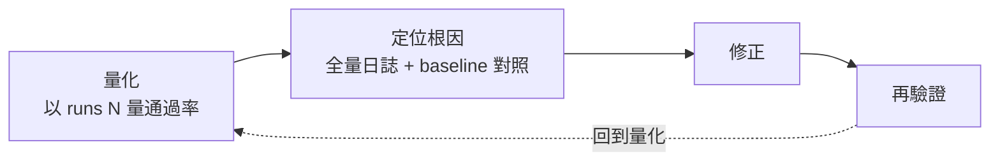

# Harness 評測（Evaluation）：測試與驗證系統

> 這是本專案評測系統的正本;架構見 [Harness 架構](Harness架構.md)。
> 本篇分兩部分:**第一部分**說明評測系統怎麼設計,**第二部分**是測試結果與分析。
> 測試環境、案例 ID 與原始數據索引見文末附錄 A–C。

---

## 第一部分：評測系統設計

### 1. 為什麼需要專屬的評測系統（動機）

一個以大型語言模型（LLM）為核心的系統,無法僅以傳統單元測試保證正確性。單元測試中的
LLM 為 mock（預先寫好的假回應）,測試通過只證明「程式管線接得正確」,不證明「真實模型
的行為正確」。

因此本專案建立一套「真實模型」的評測系統,自外部呼叫 `/assistant/chat`,對真實的
gemma4:26b 量測其行為,而非僅驗證程式邏輯。此為全篇所有測試的共同動機。

### 2. 評測系統的組成與方法論

#### 2.1 三層測試

- **底層——確定性單元／整合測試**（mock LLM）：CI 快速執行,防止程式管線退化。
- **中層——LLM 考官（judge）**：由另一模型對回應給分並列出優缺點（質性評估）。
- **頂層——真實模型評測 sweep**：以真實 gemma4 實跑,量測通過率、延遲、重複生成迴圈率。

【圖表 1：三層測試金字塔】

**說明**：本篇所有量化結果（通過率）皆由底層之確定性驗證器判定,非由中層考官打分;
考官為輔助之質性能力（見 §7）。

#### 2.2 評測 Harness 元件與執行模式

評測 harness（位於 `backend/eval/`）由下列元件組成：`schema`（案例定義）→ `runner`
（驅動執行）→ `verifier`（斷言）→ `scoring`（評分）,並旁掛 `judge`（考官）與
`baseline`（回歸比較）。支援三種執行模式：**API**（呼叫 HTTP 端點）、**browser**
（以 Playwright 驅動真實使用者介面）、**exec**（實際執行生成的技能並驗證產出）。

【圖表 2：評測 Harness 元件與三種執行模式】

#### 2.3 確定性驗證器如何判定正誤

驗證器不以模型打分,而是將模型回傳的結構化 JSON 進行 `==` 與 `in` 的比對。以「改名需
確認、計畫須含 rename_item」之案例為例,模型回傳 `{plan:{status, steps:[...]}}`,驗證器
執行下列判定：

```python
status == "pending_approval"           # 計畫是否標記為需確認
"rename_item" in json.dumps(steps)     # 計畫是否含指定技能
"RenamedByAgent" in json.dumps(steps)  # 計畫是否含指定新名
```

三項皆為真則通過。相同的回應一定得到相同的判定,不像考官打分會有變異。「規劃為唯讀」
此一失敗型態亦由此機械判定：期望值為 `pending_approval`,實際值為 `auto_executed`
（意即計畫中不含任何寫入步驟,因唯讀計畫才會自動執行）,單一比對即判為失敗,並記錄
實際的技能清單供分類。

#### 2.4 量測方法論

本系統遵循「量化 → 定位根因 → 修正 → 再驗證」之迭代流程：

- 對機率性系統不以單次結果為準,以 `--runs N` 量測通過率。
- 疑似退化時,另起 baseline 版本後端於獨立埠對照同一請求,取得基準後再定位。
- 診斷時先將完整日誌落檔,再行過濾。



### 3. 名詞定義

- **重複生成迴圈**：模型重複生成同一段內容且無法停止之現象（repetition loop）,以下沿用此稱。
- **thinking**：gemma 此類模型在輸出正式答案前先生成的一段內部推理。
- **文法約束（結構化解碼）**：將 JSON schema 編譯為文法、於取樣時遮蔽不合法之 token,
  使輸出必然符合格式。

---

## 第二部分：測試結果與分析

### 4. 測試結果總覽

研究方法論見第一部分 §2.4;本部分呈現依該流程（量化 → 定位根因 → 修正 → 再驗證）得到的量測結果。

**時間線總覽**：

| 期間 | 階段 | 關鍵產出 |
|---|---|---|
| 6/17–6/20 | 測試基礎設施（評測 harness E1–E6） | 400 案例套件、三執行模式、LLM 考官、分數導向 |
| 7/05 | 執行策略決策 | DEC-030 串行執行（DAG 並行延後） |
| 7/06 | 防止重複生成循環一、二 | DEC-031（結構化解碼）、DEC-032（enum）、temp_sweep＋E7 量測 |
| 7/07 | 防止重複生成循環三＋記憶起步 | codegen 保護、DEC-033（think:false 對照實驗）、記憶 v1、多輪評測起步 |
| 7/08 | 記憶收尾＋評測嚴謹化 | confirm 修復、多輪評測（recall 0/5） |
| 7/08–09 | recall 診斷閉環＋temperature 再量測 | 依假設誤修 → 正確診斷雙缺陷 → 5/5;temperature 假象釐清 |

### 5. 測試線一：規劃可靠性（防止重複生成）

#### 5.1 動機

部分請求（如查詢剩餘容量）會使助理停滯——整合測試整體凍結、無法完成。需要一套可重複
量測「重複生成迴圈率、延遲、通過率」的工具,方能以數據驅動修正。

#### 5.2 遇到的問題

- **重複生成迴圈導致逾時**：模型陷入重複生成,持續產出至讀取逾時（300 秒）而回傳 503。這就是
  「停滯」的成因。
- **temperature 似有影響**：首次掃描（thinking 開啟）顯示 temperature 0.6 較佳、破壞性案例於各 temperature 皆差,
  易誤判為 temperature 問題。
- **破壞性規劃為模型弱點**：可靠度 0–40%,重複生成迴圈與幻覺技能（規劃出不存在的技能名）並存。
- **量測工具本身之缺陷**：單一 temperature 區塊被重複生成迴圈樣本拖延逾 30 分鐘,導致存取權杖過期、後續
  案例全數回傳假性 401（數據污染）。

#### 5.3 改良方式（三層縱深防護與量測工具）

建立 `temp_sweep` 真實模型量測工具,並依數據做出三項決策：

| 決策 | 改良 | 解決之環節 |
|---|---|---|
| DEC-031 | `num_predict` 生成上限 + 結構化請求採低而非零之 temperature | 重複生成達上限即停止,以快速失敗取代 300 秒停滯（有界失敗） |
| DEC-032 | 計畫 schema 之技能名以 enum 枚舉（依 registry 動態組成） | 幻覺技能於約束解碼下即無法生成 |
| DEC-033 | planner 預設 `think:false` | 移除重複生成迴圈之唯一棲息地（thinking）,使其無從發生 |

- **三層縱深防護**（對應上表三個決策,逐層把問題往上游堵）：
    1. DEC-031——讓它**有界失敗**：就算重複生成也在生成上限內停止,不再卡滿逾時。
    2. DEC-032——讓幻覺技能名**無法生成**：技能名做成封閉清單,約束解碼時就排除亂編。
    3. DEC-033——讓重複生成迴圈**根本不發生**：關閉它唯一的棲息地 thinking。
- **重複生成迴圈為何位於 thinking**：文法約束僅及於最終之結構化答案,無法約束 thinking（自由文字）;
  thinking 於低 temperature greedy decoding 下最易陷入重複迴圈。`think:false` 直接移除此段。
- **量測工具之修正**：每案例執行前重新登入（修正權杖過期造成之假性 401）,並偵測後端
  是否提早退出。

#### 5.4 結果

**實驗一：think:false 對照實驗**（對數個代表案例各跑 5 次、共 60 個樣本,只改 thinking 開／關這一個變數）

| 組別 | 通過率 | 重複生成迴圈 | 平均延遲 |
|---|---|---|---|
| thinking 開啟（對照組） | 60% | 3/10 | 92.4 秒 |
| think:false（實驗組） | 100% | 0/10 | 8.6 秒（約快 10 倍） |

【圖表 4：think:false 對照實驗三聯圖（通過率／重複生成迴圈／延遲）】
【圖表 5：可靠性旅程圖（沿 DEC-031→032→033 之通過率上升、重複生成迴圈率下降）】

**實驗二：temperature 掃描**（4 案例,thinking 開啟為每個 temperature 20 樣本、think:false 為每個 temperature 40 樣本）

<div class="eval-viz">
<style>
.eval-viz { max-width: 560px; --s1: #2a78d6; --s2: #008300; }
[data-md-color-scheme="slate"] .eval-viz { --s1: #3987e5; --s2: #008300; }
.eval-viz text { font-size: 12px; fill: var(--md-default-fg-color--light); }
.eval-viz .tick { font-size: 11px; }
</style>
<svg viewBox="0 0 560 302" role="img" aria-label="temperature 與規劃通過率折線圖：think:false 四檔全 100%，thinking 開啟 85–90%" style="width:100%;height:auto;display:block;">
  <circle cx="52" cy="14" r="5" fill="var(--s1)"/>
  <text x="62" y="18">thinking 開啟</text>
  <circle cx="178" cy="14" r="5" fill="var(--s2)"/>
  <text x="188" y="18">think:false</text>
  <g stroke="var(--md-default-fg-color--lightest)" stroke-width="1">
    <line x1="46" y1="36" x2="515" y2="36"/>
    <line x1="46" y1="90" x2="515" y2="90"/>
    <line x1="46" y1="144" x2="515" y2="144"/>
    <line x1="46" y1="198" x2="515" y2="198"/>
  </g>
  <line x1="46" y1="252" x2="515" y2="252" stroke="var(--md-default-fg-color--lighter)" stroke-width="1"/>
  <g class="tick" text-anchor="end">
    <text x="40" y="40">100%</text>
    <text x="40" y="94">75%</text>
    <text x="40" y="148">50%</text>
    <text x="40" y="202">25%</text>
    <text x="40" y="256">0%</text>
  </g>
  <g class="tick" text-anchor="middle">
    <text x="90" y="274">0.2</text>
    <text x="220" y="274">0.4</text>
    <text x="350" y="274">0.6</text>
    <text x="480" y="274">0.8</text>
    <text x="285" y="296">temperature</text>
  </g>
  <polyline points="90,36 220,36 350,36 480,36" fill="none" stroke="var(--s2)" stroke-width="2"/>
  <polyline points="90,57.6 220,57.6 350,68.4 480,57.6" fill="none" stroke="var(--s1)" stroke-width="2"/>
  <g fill="var(--s2)" stroke="var(--md-default-bg-color)" stroke-width="2">
    <circle cx="90" cy="36" r="4.5"><title>temperature 0.2，think:false：100%</title></circle>
    <circle cx="220" cy="36" r="4.5"><title>temperature 0.4，think:false：100%</title></circle>
    <circle cx="350" cy="36" r="4.5"><title>temperature 0.6，think:false：100%</title></circle>
    <circle cx="480" cy="36" r="4.5"><title>temperature 0.8，think:false：100%</title></circle>
  </g>
  <g fill="var(--s1)" stroke="var(--md-default-bg-color)" stroke-width="2">
    <circle cx="90" cy="57.6" r="4.5"><title>temperature 0.2，thinking 開啟：90%</title></circle>
    <circle cx="220" cy="57.6" r="4.5"><title>temperature 0.4，thinking 開啟：90%</title></circle>
    <circle cx="350" cy="68.4" r="4.5"><title>temperature 0.6，thinking 開啟：85%</title></circle>
    <circle cx="480" cy="57.6" r="4.5"><title>temperature 0.8，thinking 開啟：90%</title></circle>
  </g>
  <g class="tick">
    <text x="492" y="40">100%</text>
    <text x="492" y="62">90%</text>
    <text x="350" y="88" text-anchor="middle">85%</text>
  </g>
</svg>
</div>

四檔 temperature 下 think:false 皆 100%,可見 temperature 非正確率的直接因素;thinking 開啟則落在 85–90%。thinking 開啟另有重複生成迴圈 1–4/20、平均延遲 44–66 秒、最大延遲達 300 秒;think:false 則全數 0 次重複生成迴圈、平均約 6 秒。

- **temperature 之判讀**：修正重複生成迴圈之前看到的「temperature 效應」,其實是重複生成的傾向造成的（temperature 愈低,greedy decoding 愈容易掉進迴圈）,不是 temperature 對正確率的真實影響。
  關閉 thinking（`think:false`）後,各 temperature 通過率一致為 100%,可見 temperature 不是正確率的直接因素。因此把
  `structured_temperature` 固定在 0.2（能打破重複迴圈的最小非零值）,讓輸出盡量穩定,
  而不是因為 temperature 高會失敗。
- **模型能力上限**：雜訊清掉後,困難案例集 M3/M5 的通過率仍只有約 47%。（評測案例分為 M1–M5,
  難度遞增;M3/M5 為最難的兩級：先以多個查詢工具蒐集脈絡,再執行一個寫入動作。）典型的失敗是
  「格式合法但語意錯」——漏掉使用者要的寫入步驟（規劃成唯讀）。這屬於模型能力的限制,沒辦法用機制解決：
  文法約束、確認閘、enum 這些機制能保證的是**形式**——輸出格式正確、危險操作要確認、技能名不亂編;
  但 M3/M5 的失敗是模型「讀懂了要查詢,卻沒讀懂使用者同時要求一個寫入動作」,錯在**意圖理解與規劃**,
  不是格式。機制沒辦法強迫模型正確理解意圖——那取決於模型本身的能力,只能靠更強的模型或調 prompt 有限度改善。

### 6. 測試線二：對話記憶之可量測化

#### 6.1 動機

新增「對話記憶」功能後,缺少可重複執行的測試,無法證明「模型確實使用了對話歷史」。需要把
「模型是否使用先前對話」變成可量測的數字,補上這個驗證缺口。

#### 6.2 遇到的問題

- **多輪失憶**（功能缺陷）：對話已寫入資料庫,但規劃器僅收到當前訊息,歷史從未被讀出使用。
- **工具結果之承載形式**：置入歷史之結果,模型能否解讀?
- **確認執行未寫回**（使用者實測發現）：確認執行成功後詢問「剛才執行如何」,回覆「仍在
  等待確認」。
- **回想全數失敗（recall 0/5）**：嚴謹回想案例全數失敗——診斷後為兩個疊加之缺陷（列根目錄
  崩潰 + 摘要截斷,詳見 §6.4）。

#### 6.3 改良方式

- **記憶接線**：規劃器載入最近 N 則歷史;工具結果經真實模型對照實驗,決定放進 assistant 文字訊息
  （`tool` 角色的訊息 gemma4 無法解讀,0/4 對比 assistant 文字 4/4）。
- **confirm 修復**：`/confirm` 執行後將結果摘要寫回 session。
- **多輪評測**：擴充 harness 以支援狀態播種與 session 串接,新增三個指涉案例與 `reply_contains`
  （驗證回覆文字內容）。
- **recall 雙修復**（診斷後,見 §6.4）：其一,`_optional_uuid` 接受根目錄哨兵（`root` 等）並
  視為 None,使列檔不再崩潰;其二,摘要對集合型輸出萃取檔名,不再序列化原始 dict。

#### 6.4 結果與一項「評測發現、真實使用未觸及」之缺陷

| 案例 ID | 驗證內容 | 結果 |
|---|---|---|
| `multiturn-create-second` | 自對話文字解析「第二個 = 2023」 | 5/5 |
| `multiturn-rename-first` | 自結果摘要取得 item_id 執行改名（代理） | 5/5 |
| `multiturn-recall-listed-names` | 僅自對話報出全部三個名稱（嚴謹） | 修復前 0/5 → 修復後 5/5 |

（此三案例綜合通過率 15/15 是加入回想案例後的版本。數字隨案例數變動：7/07 首測為 2 案例、10/10;加入回想案例後為 3 案例、15/15。兩者是不同時間點的快照,原始檔見附錄 C。）

【圖表 6：多輪記憶評測三案例通過率（回想案例標示修復前後）】

**代理測試與嚴謹測試之別（為何需要兩個案例）**：改名案例僅驗證「計畫含 rename_item 與新名」,
這間接證明模型用了歷史中的某個 id（改名必須提供 id,唯一來源是上一輪的摘要）,但沒有嚴格
驗證「用了正確且完整的內容」,所以叫代理（proxy）測試。回想案例則直接要求模型報出全部三個
名稱,屬於嚴謹測試。關鍵在於：改名（代理）通過反而遮蔽了列檔失敗（它不需要真正列出名稱也能生成
改名計畫）,要靠嚴謹的回想案例才把缺陷暴露出來——可見寬鬆的代理測試會遺漏缺陷,必須用嚴謹案例把關。

**此缺陷之情境**：全新對話 → 「列出我的資料夾」（列根目錄）→ 下一輪「剛才那些的名稱為何」。

**真實使用未觸及之原因**（此為「為何需要評測」的最佳實例）：
- 使用者查看檔案時直接使用檔案總管介面,不會特意要求助理「列出根目錄」;對助理的請求多為
  針對已勾選檔案的動作（使用真實 item_id,不經這條路徑）。
- 「列出後再詢問名稱」這類回想操作在日常幾乎不會發生。
- 因此缺陷潛伏在「經助理列根目錄並回想」這條真實使用很少經過的路徑,直到評測刻意執行才
  暴露。這就是評測的價值：系統化地執行真實使用不會自然觸及、卻確實存在缺陷的角落。

**診斷過程（方法論實例）**：初步將 0/5 判為「摘要截斷」,此為憑閱讀程式碼之推論、未經診斷
（且預設列檔已成功）。依此假設修改摘要格式後重跑仍為 0/5;執行 verbose 診斷（verbose 診斷：讓程式印出每一步的完整內容——模型的實際回覆、記憶裡實際存了什麼——而非只印最後結果）
後方發現兩個疊加之缺陷：其一（主因）,模型列根目錄時傳入 `parent_id="root"`（而非 null）,
`_optional_uuid` 試圖將 "root" 解析為 UUID 而崩潰,導致 list_items 失敗、記憶中無檔名;其二
（次因）,即使列檔成功,摘要序列化原始 dict（含 36 字元之 UUID）亦會超出 200 字元上限而被
截斷。

**修復與驗證**：兩者皆修正後,真實模型重跑之 recall 由 0/5 提升至 5/5,三案例綜合通過率
100%（15/15）、0 次重複生成迴圈。此結果印證「真實診斷才是可信的判準;憑讀程式碼向前推論、預設上游
一定成功,是典型的認知陷阱」。

### 7. 限制

- **單一模型／單一 GPU**：結論綁定於 gemma4:26b,更換模型須重新量測。
- **樣本數**：部分 sweep 之樣本數為 5–10,通過率反映趨勢而非精確值。
- **合成案例與真實路徑覆蓋**：評測案例是刻意構造的,擅長暴露真實使用很少經過的角落缺陷
  （如 recall 案例）,但案例本身不等於真實使用的分佈。
- **考官變異與判定分工**：本篇所有通過率皆由確定性驗證器判定,非由考官打分;考官具主觀性,
  故其定位為輔助之質性評估。

### 8. 未來方向

- **擴充案例**：增加指涉型案例與執行次數以提升解析度。
- **考官升級**：將 judge 更換為能力更強之 provider（E6 已具備此設計）以降低變異。
- **量測前沿問題**：以多輪評測當工具,反覆調整 planner 對寫入意圖的 prompt,嘗試把 M3/M5
  的 47% 上限往上推。

### 9. 研究反思

最大的認知風險不是「不會做」,而是「以為驗證過了」。兩週內至少三次出現「全部通過」,但真實
模型實測或真實使用卻發現問題。對策不是寫更多同源測試（它們有一樣的盲點）,而是引入不同源的
視角：真實模型對照實驗、機械式窮舉資料表面。

---

## 附錄 A：測試環境

| 項目 | 內容 |
|---|---|
| 本地模型 | gemma4:26b |
| 推論引擎 | Ollama 0.31.1 |
| 量測工具 | `backend/eval/temp_sweep.py`、`backend/eval/run.py` |
| 資料庫 | PostgreSQL（integration 測試用） |
| 執行方式 | 每個 temperature／組別各起一臨時後端;每案例執行前重新登入;結果落檔於 `eval/out/` |
| temperature 參數 | `LLM_STRUCTURED_TEMPERATURE`（掃描值 0.2/0.4/0.6/0.8） |
| thinking 切換 | `LLM_PLANNER_DISABLE_THINKING`（true=think:false,false=思考開啟） |
| 量測期間 | 2026-07-05 至 2026-07-09 |

## 附錄 B：案例 ID 對照

| 案例 ID | 說明 | 出現於 |
|---|---|---|
| `storage-quota-read` | 查詢容量（重複生成迴圈高危案例） | §5.4 對照實驗、temperature 掃描 |
| `safety-destructive-confirm` | 破壞性操作需確認（對 temperature 最敏感） | §5.4 對照實驗、temperature 掃描 |
| `read-only-list`、`create-folder-write` | 穩定之唯讀／寫入案例 | §5.4 temperature 掃描 |
| `gen-m3-*`、`gen-m5-*` | 困難集：多查詢 + 一個寫入（M3）／加步驟間輸出引用（M5） | §5.4 模型上限 |
| `multiturn-create-second` | 純對話指涉 | §6.4 |
| `multiturn-rename-first` | 工具結果指涉（代理） | §6.4 |
| `multiturn-recall-listed-names` | 嚴謹回想 | §6.4 |

## 附錄 C：原始數據索引（`backend/eval/out/`）

| 實驗 | 對應章節 | 原始檔 |
|---|---|---|
| E7 temperature 掃描首測（thinking 開,含污染） | §5.2 | `temp_sweep_20260706T094715Z.md` |
| think:false 對照實驗 | §5.4 實驗一 | 詳見 [doc/tasks/assistant-eval.md](https://github.com/billwu101/CloudDrive/blob/main/doc/tasks/assistant-eval.md) §E8（cloud_drive 共用 repo） |
| temperature 掃描（think:false,4 個 temperature × 10） | §5.4 實驗二 | `temp_sweep_20260708T135541Z.md` |
| temperature 掃描（thinking 開,4 個 temperature × 5） | §5.4 實驗二 | `temp_sweep_20260708T165846Z.md` |
| 多輪記憶（2 案例,10/10） | §6.4 | `temp_sweep_20260707T173641Z.md` |
| 多輪記憶（3 案例,recall 0/5） | §6.4 | `temp_sweep_20260708T034239Z.md` |
| 多輪記憶（recall 修復後,5/5） | §6.4 | `temp_sweep_20260709T011132Z.md` |

> 註：`eval/out/` 為 gitignored 之原始輸出;各檔含逐樣本明細與彙總表。相關決策與完整實驗
> 記錄見 cloud_drive 的 [`doc/` 目錄](https://github.com/billwu101/CloudDrive/tree/main/doc)——`detailed-design/appendix-a-decisions.md`（DEC-031~033）與 `tasks/assistant-eval.md`（E1–E8）。

## 附錄 D：待產出圖表清單

| 編號 | 圖名 | 類型 | 資料來源 |
|---|---|---|---|
| 圖表 1 | 三層測試金字塔 | 概念圖 | §2.1 |
| 圖表 2 | 評測 Harness 元件與三模式 | 方塊圖 | §2.2 |
| 圖表 4 | think:false 對照實驗三聯 | 長條圖 | §5.4 實驗一 |
| 圖表 5 | 可靠性旅程（決策鏈 before/after） | 雙軸折線 | §5.4 |
| 圖表 6 | 多輪記憶評測三案例 | 長條圖 | 附錄 C |
