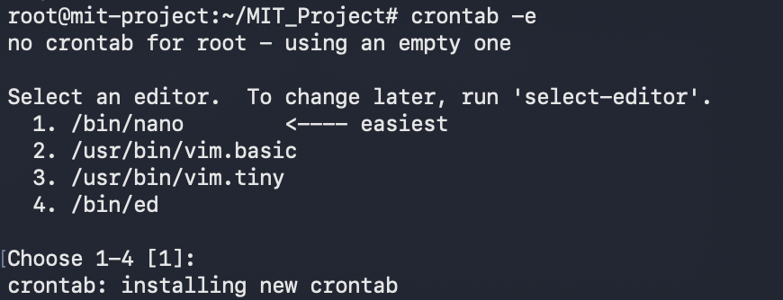
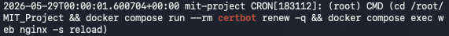

# 部署與環境

> 蒸餾自五月日誌（Docker／nginx／SSL／CI-CD 段落）與 CloudDrive 期的環境實測記錄。完整的當日脈絡與截圖見 [2026-05-前置期-全端基礎](../01-日誌/2026-05-前置期-全端基礎.md)。

## Docker

### 核心元素

- **Image**：唯讀模板（Dockerfile build 或 Docker Hub 下載）；分層儲存有快取，只有改變的層之後才重新 build。
- **Container**：Image 的執行實例；建立參數（網路、port、環境變數）設定後不能改，要改就刪掉重建。
- **Volume**：獨立於容器生命週期的持久化儲存；`docker compose down` 保留 Volume、`down -v` 連 Volume 一起刪（資料永久消失），正常重新部署用前者。
- **網路**：預設 bridge 只能用 IP 互訪；自訂網路才啟用內建 DNS，容器名稱自動解析、可用名稱互訪。

### 踩過的陷阱

- **latest tag**：`postgres:latest` 幾週後 pull 到新主版本，data directory 格式不相容、容器起不來——正式環境永遠指定明確版本（如 `postgres:15`）。
- **`docker system prune -a`**：以「是否有 Running 容器使用」為標準，Exited 容器與無 Running 容器附掛的網路都會被刪；曾連帶刪掉自訂網路導致容器卡在 Created。Volume 不在 `-a` 範圍、資料無恙。
- **compose 的 initdb 只跑一次**：`initdb/` 掛進 `/docker-entrypoint-initdb.d/` 只在 Volume 全新時執行；`down -v` 之後才會重新初始化。
- **一半空間沒分配（LVM）**：Ubuntu 安裝預設 LVM 只把一半磁碟給根目錄；`vgdisplay` 查可用空間 → `lvextend -l +100%FREE` → `resize2fs` 通知檔案系統。
- **1GB RAM build 失敗**：同時 build 多個大 image 記憶體峰值超限，TLS handshake timeout；加 swap 解決（`fallocate` → `mkswap` → `swapon`），swap 慢但避免 OOM kill。

## nginx 與 HTTPS 上線

完整流程（需要：網域＋SSL 憑證＋nginx 設定）：

1. 取得網域、DNS A Record 指向伺服器（Let's Encrypt 不支援裸 IP——驗證流程以網域為主體）。
2. nginx port 80 服務 ACME 驗證路徑 `/.well-known/acme-challenge/`。
3. docker-compose 加 certbot 服務與兩個共享 Volume（驗證用＋存憑證）；**certbot 與 nginx 掛同一個憑證 Volume**，certbot 寫入、nginx 直接讀，永遠不需手動複製憑證。
4. 先 `--dry-run` 再正式申請（ACME 伺服器偶爾回 Service busy，等一兩分鐘重試即可）。
5. nginx 加 443 server block 指向憑證路徑、port 80 改 redirect——這是唯一手動改的地方，之後續期不用再動。
6. **修復 Mixed Content**：HTTPS 頁面發出的 HTTP 請求會被瀏覽器直接擋掉；在 nginx 加 `/api/` proxy 讓 API 走同一個 HTTPS 網域，前端 `VITE_API_URL` 改 https。
7. cron 每天兩次 `certbot renew`（剩不到 30 天才真的續期）＋續期後 `nginx -s reload`；用 `grep certbot /var/log/syslog` 驗證 cron 有跑。

Let's Encrypt vs Cloudflare 的取捨：Let's Encrypt 的 SSL 在自己的伺服器終止、流量直達（適合學習與理解底層）；Cloudflare 在其邊緣終止、額外提供 CDN／DDoS 防護（適合生產環境），但憑證不在自己手上。

零散但重要：

- `proxy_pass http://api:8000/` 的 trailing slash 會把 `/api/` 前綴去掉（`/api/events` → `/events`）。
- nginx `client_max_body_size` 預設 1MB，大檔上傳會在到達後端前被 413 擋下。
- 前端部署用 multi-stage build：第一階段 node build、第二階段只留 nginx＋dist，image 更小。
- 為什麼要 HTTPS：HTTP 明文傳輸，登入帳密與 JWT token 在路上任何節點都讀得到；TLS 加密之外也驗證伺服器身份（CA 簽發憑證）防中間人。

## CI/CD（GitHub Actions）

- `deploy.yml`：push 到 main 觸發，Actions 用 SSH 私鑰連進伺服器執行 `git pull && docker compose up -d --build`；IP 與金鑰放 GitHub Secrets。
- **paths 過濾**：預設任何 push 到 main 都觸發部署；加 `paths` 限定只有程式相關檔案變動才部署，改文件不再觸發。
- **`.env` 不進 git、每台機器手動建立一次**：`git pull` 不會建立或同步被 ignore 的檔案；部署新機器時 compose 找不到 `.env` 會中斷。
- **部署半途失敗＝新舊程式碼不一致**：CI 流程中任一步失敗（如缺 `.env`），後續不執行；Actions 看起來「有跑」但容器沒重建，前後端版本錯開會出現 422 之類的詭異錯誤。判讀：部署「有觸發」≠「有完成」。
- 機密管理原則：機密不寫進被 git 追蹤的檔案（public repo＝公開）；經 `env_file: .env` 注入；`.gitignore` 的忽略是雙向的（push 不上去、pull 不會刪）。
- Linux 隱藏檔：檔名以 `.` 開頭（`.env`、`.gitignore`）預設不顯示，`ls -la` 才看得到。

## VPS vs PaaS

- VPS（DigitalOcean Droplet 等）：拿到一台 Linux 主機自己管，docker-compose 直接跑，彈性大、學到真實操作。
- PaaS（Railway／Render 等）：平台用自己的邏輯解讀 repo（看到 Dockerfile 就單容器部署），**不跑 docker-compose.yml**；多服務有平台自己的管理方式。
- `docker-compose.yml` 的適用範圍：本機開發與自管 VPS。

## SSH 金鑰

- HTTPS push 需要 PAT（GitHub 不再收密碼；OAuth 登入的帳號甚至沒有密碼可用），SSH 金鑰配對後不需輸入任何東西。
- 檔案角色：`id_ed25519` 私鑰（不外洩）／`.pub` 公鑰（放 GitHub）／`known_hosts` 記錄連過的主機指紋（防中間人）／`authorized_keys` 控制誰能 SSH 進來這台機器。
- 新機器三步：`ssh-keygen -t ed25519` → 公鑰加 GitHub → `ssh-keyscan github.com >> ~/.ssh/known_hosts`；remote 改 SSH 格式。

## CloudDrive 開發環境事實與陷阱

- 測試資料庫容器：`pgvector/pgvector:pg16`（不是 `postgres:16-alpine`，後者沒有 pgvector），host port **5434**，內含 app 與 `clouddrive_test` 兩個 DB；帳密與連線字串見 `backend/.env`（不寫入筆記）。
- 後端 dev server 曾改跑 **8001**（8000 被其他專案佔用），此時前端要帶 `VITE_API_BASE_URL` 指向對應 port。
- 本機 LLM 走內網 Ollama 主機（位址見 `backend/.env`）：
  - 主機連不到時預設逾時長達 300s，`connect_timeout=5s` 讓它秒失敗。
  - 原則：「連不到」要快速失敗，不能讓使用者等分鐘級逾時。
- 長時間批次量測會超過 access token 壽命，中途開始收 401 假失敗——每案例前重新登入；量測 harness 對子行程存活也要檢查，否則後端死了整批數據作廢（量測工具本身也要驗）。
- AI 助理（Claude Code 類工具）的 shell 是非互動子行程：dev server 這類長駐程式應由自己在終端機分頁執行（能看 log、能中斷），不交給 agent 背景執行；agent 的自訂指令（skill）以 Markdown 檔定義，檔名即指令名。
