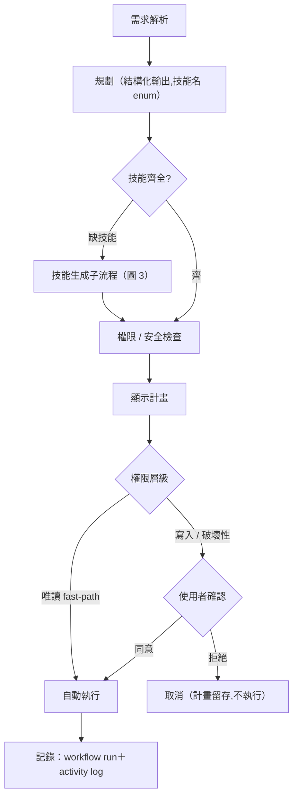

# CloudDrive In-App AI Assistant：Agent Harness 架構設計

> 報告文件（受眾：指導老師）。本頁為 Markdown 版,正式版以 docx 為準;測試與數據詳見 [測試系統報告](測試系統報告.md)。
> 底稿與細節出處（cloud_drive 共用 repo,內文的 `doc/*` 路徑皆指該 repo）：[harness-architecture.md](https://github.com/billwu101/CloudDrive/blob/main/doc/harness-architecture.md)、[detailed-design.md](https://github.com/billwu101/CloudDrive/blob/main/doc/detailed-design.md) §9、[decisions.md](https://github.com/billwu101/CloudDrive/blob/main/doc/decisions.md)。
> 圖以【圖 N】佔位標示（部分已以 Mermaid 呈現於網站版,正式圖檔另行產出,見文末「圖表清單」）。

---

## 1. 目的與定位

CloudDrive 是一套自架雲端硬碟,內嵌一個**在地運行（本機 gemma4:26b，不上雲）的 AI 助理**,
讓使用者以自然語言操作檔案（搜尋、整理、壓縮、還原…）。本文件說明助理背後的
**Agent Harness**——即「把一個語言模型包裝成可靠、可治理、可驗證的代理系統」的架構。

核心設計哲學貫穿全文:

> **能用機制保證的,就不靠模型自覺。** 格式交給 grammar、衍生欄位交給程式、
> 危險操作交給權限閘、記憶交給歷史回放、可靠性交給結構化解碼——模型的能力預算
> 只花在真正需要「智慧」的規劃判斷上。

這個哲學是本專案面對「本地小模型不夠聰明」的根本應對,也是後續所有決策的主軸。

## 2. 整體架構：六核心元件 ↔ 九實作模組

本專案的 harness 對應到 agent 系統的六個通用核心元件（E/T/C/S/L/V）,並以九個實作模組落地。

【圖 1：Harness Runtime 六元件架構圖】

> 說明：Workflow Pipeline 在最上、六元件 Runtime 在中、V（評測介面）
> 畫在**旁側**（虛線箭頭指向系統,表示它是離線工具、不在請求路徑上）,最下為 Service 層 →
> DB/Storage。此圖是全報告的骨幹圖。ASCII 原型見 cloud_drive 的 `doc/harness-architecture.md §5`。

| 元件 | 職責 | 主要實作檔 |
|---|---|---|
| **E** Execution Loop | 主迴圈：送訊息→解析→執行→回填;workflow 執行器管步驟相依/錯誤策略;可派生 bounded sub-agent;**模型介面（ModelRouter）亦歸此** | `service.py`、`workflow.py`、`subagent.py`、`llm/router.py` |
| **T** Tool / Skill Registry | 內建、使用者自建、現場生成的技能來源;manifest 定義 schema/權限/handler | `skills/registry.py`、`skills/manifest.py`、`skills/authoring.py` |
| **C** Context Manager | token 預算、裁切、工具輸出瘦身、技能清單注入、system prompt 組裝、**對話歷史回放** | `context.py`、`planner.py`、`memory.py` |
| **S** State Store | session/messages/skills/workflows 持久化,全依 `user_id` 隔離 | `repository.py` + migrations |
| **L** Lifecycle Hooks | 治理層攔截點;強制執行權限分層、核可、沙箱、稽核、**外送隱私閘** | `hooks.py`、`permissions.py`、`codeguard.py`、`sandbox.py` |
| **V** Evaluation Interface | 離線開發者工具：確定性斷言 + LLM judge + baseline 回歸,API/browser/exec 三模式 | `backend/eval/`（詳見 [測試系統報告](測試系統報告.md)） |

**呈現時的三個注意事項（答辯用）**：
1. **V 不在請求路徑上**——它從外部打 `/assistant/chat` 評測,圖上畫在旁側。
2. **sub-agent 目前唯一實例是 CodegenSubAgent**——不是通用多代理編排;正確說法是
   「主迴圈可派生 bounded sub-agent,目前實例化為 codegen 子代理」。
3. **L 的分層**——hooks 是治理層,permissions/codeguard/sandbox 是它在各攔截點強制執行的機制。

## 3. Workflow 執行管線（請求路徑）

助理處理一則自然語言請求的完整流程:

【圖 2：Workflow 執行管線流程圖】

> 說明：確認節點分兩路：唯讀自動執行(fast-path)、寫入/破壞性走人工確認。
> 對應 cloud_drive 的 `doc/detailed-design.md §9.3`。

關鍵設計:
- **結構化輸出（DEC-032）**：規劃階段用 json_schema grammar 約束,技能名以 enum 枚舉 →
  幻覺技能在取樣層即不可生成。
- **權限分層（DEC-019）**：唯讀自動 / 破壞性需確認 / 生成碼需核可+沙箱+稽核。
- **誠實失敗（DEC-029）**：執行失敗如實回報 StepResult,不偽裝成功;僅在唯讀時做一次
  有限度重規劃,**不採 agentic loop**（弱模型下無界迴圈風險 > 收益）。
- **串行執行（DEC-030）**：DAG 並行延後,因「所有技能共用同一 AsyncSession」需先解。

## 4. 模型路由與隱私閘

【圖 4：模型路由 + 隱私閘決策流程圖】
> 說明：決策樹。使用者每則訊息自選模型來源(本機 Ollama / 具名外部連線) → 隱私分類 →
> 敏感且無法去識別化則**拒送外部** → 選定模型單一執行(無自動 fallback) → 失敗回可區分錯誤
> (連不到/憑證被拒/額度耗盡)。對應 `harness-architecture.md §4`。

- **使用者每則訊息自選模型**（本機 gemma4:26b 或 per-user 加密的具名外部連線）,選定即唯一執行器。
- **隱私閘永遠在（DEC-023）**：即使手動選外部,敏感內容仍拒送。
- 原「本地失敗自動升級外部」已被手動選擇取代,僅保留於 `target=None` 相容路徑。

## 5. 對話記憶子系統（7 月新增）

助理原本每輪只把當前訊息交給規劃器（歷史有存 DB、但沒回讀）,多輪指涉失效。記憶 v1 補上回讀。

【圖 5：對話記憶資料流圖】
> 說明：序列/資料流圖。左路「/chat：載入最近 N 則歷史 → 夾入規劃器 prompt → 執行 →
> 結果摘要接回 assistant 訊息存 DB」;右路「/confirm：手動確認執行 → 結果摘要亦寫回 session」。
> 標示 trim 上限與『工具結果以 assistant 文字承載』。對應 `doc/proposal-assistant-memory.md`。

- **回讀**：router 載入最近 `assistant_history_max_messages`(12) 則,夾在 `[system, *history, 當前]`。
- **工具結果承載＝assistant 文字**（非 tool 角色）：真模型 A/B 顯示 gemma4 不消化孤立 tool 訊息
  （0/4 幻覺 vs assistant 文字 4/4）→ 決策依據,零 migration。
- **確認執行寫回**：`/confirm` 端點原不寫歷史 → 修復為執行後把結果摘要寫回 session。
- **限制（誠實）**：滑動視窗（~6 輪）、摘要每步 200 字截斷、單 session、靠最近非相關。
  多輪 eval 的 recall 案例 0/5 即揭露「摘要保真」缺口（詳見 [測試系統報告](測試系統報告.md) §4）。

## 6. 技能生成與治理（自我撰寫技能）

缺技能時,助理可**現場生成**一個新技能,但受嚴格治理:

【圖 3：技能生成子流程圖】
> 說明：流程圖 codegen(結構化輸出產 skill) → codeguard(靜態安全檢查) → sandbox(隔離執行) →
> approve(使用者核可) → execute → ingest(安裝回 registry)。標示「生成也是 workflow 化的前置子流程」。
> 對應 `doc/detailed-design.md §9.93.1`、DEC-019。

- codegen 用結構化輸出保證 `{name, description, version, code, ui}` 信封;handler/version 由程式注入。
- 生成碼經 codeguard 靜態檢查 + sandbox 隔離執行 + 使用者核可 + 稽核,才安裝。

## 7. 設計原則沉澱（決策鏈）

本專案的可靠性來自一連串**資料驅動的決策**,每個都有根因與驗證（[測試系統報告](測試系統報告.md) 詳述數據）:

| 決策 | 原則 |
|---|---|
| DEC-017 | 助理一律經 service 層,不直接碰 DB/FS |
| DEC-019 | 生成技能：核可 → 沙箱 → 稽核 |
| DEC-020 | session/技能持久化到 DB |
| DEC-029 | 失敗回覆由程式以執行結果組合（honest reporting）+ 有限重規劃,不採 agentic loop |
| DEC-031 | 結構化解碼防跳針（num_predict + 非零溫度） |
| DEC-032 | schema enum：幻覺技能 grammar 級不可生成 |
| DEC-033 | planner 預設關 thinking（跳針治本、快 10×） |

**共通主軸**：把保證從「請求模型遵守」升級為「使其不可違反」。

## 8. 限制與未來方向

**架構層限制（誠實）**
- sub-agent 僅 codegen 一種實例,非通用多代理。
- 執行串行,DAG 並行未做（DEC-030 前置未解）。
- 斷線無取消：放棄的請求仍佔用 Ollama 單一併發槽（真實使用中發現）。

**模型層限制**
- 單一本地模型（gemma4:26b）;規劃能力有天花板（寫入意圖規劃約 47%,機制救不了）。

**未來可行方向**
- 工程可達成：斷線取消、記憶摘要格式修復、codegen 系統化跑分。
- 模型前沿（推非解）：planner 寫入意圖 prompt 工程,用多輪 eval 迭代。
- 記憶 v2：摘要壓縮 → 語意檢索（復用搜尋的 pgvector）→ 跨 session。

## 9. 文獻定位

本 harness 對應 agent 系統六核心元件的通用框架;本專案的特色貢獻在於
**「本地小模型 + 機制化可靠性」**——用 grammar/num_predict/thinking 配置等機制,
把一個 26B 本地模型馴服到可用的可靠度,而非依賴更大的雲端模型。
（文獻筆記見 [harness筆記](../02-筆記-harness/harness筆記.md) 第一部 §6。）

---

## 附：本文件的圖表清單（待產出）

| 編號 | 圖名 | 類型 | 資料/出處 |
|---|---|---|---|
| 圖 1 | Harness Runtime 六元件架構 | 分層方塊圖 | harness-architecture §5 |
| 圖 2 | Workflow 執行管線 | 流程圖 | detailed-design §9.3 |
| 圖 3 | 技能生成子流程 | 流程圖 | detailed-design §9.93.1 |
| 圖 4 | 模型路由 + 隱私閘 | 決策樹 | harness-architecture §4 |
| 圖 5 | 對話記憶資料流 | 資料流/序列圖 | proposal-assistant-memory |
