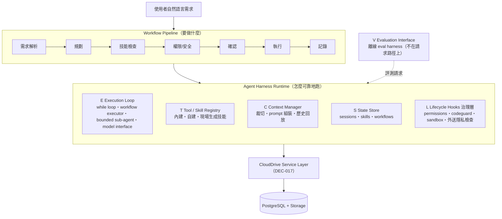
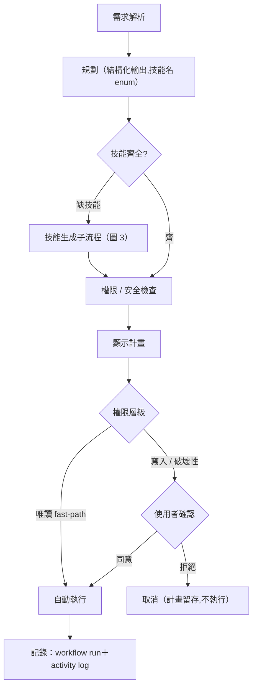

# CloudDrive In-App AI Assistant：Agent Harness 架構設計

> 測試與數據詳見 [測試系統報告](測試系統報告.md)。
> 底稿與細節出處（cloud_drive 共用 repo,內文的 `doc/*` 路徑皆指該 repo）：[harness-architecture.md](https://github.com/billwu101/CloudDrive/blob/main/doc/harness-architecture.md)、[detailed-design.md](https://github.com/billwu101/CloudDrive/blob/main/doc/detailed-design.md) §9、[decisions.md](https://github.com/billwu101/CloudDrive/blob/main/doc/decisions.md)。
> 圖以【圖 N】佔位標示（部分已以 Mermaid 呈現於網站版,正式圖檔另行產出,見文末「圖表清單」）。

---

## 1. 目的與定位

CloudDrive 是一套自架雲端硬碟,內嵌一個在本機運行、不連到雲端的 AI 助理（採用本地模型 gemma4:26b）,
讓使用者以自然語言操作檔案（搜尋、整理、壓縮、還原等）。本文件說明助理背後的
**Agent Harness**——把一個語言模型包裝成可靠、可治理、可驗證的代理系統的架構。

設計原則:**能用程式機制保證的事,就不交給模型自行判斷。** 輸出格式以 grammar（語法約束）
保證、衍生欄位由程式計算、危險操作交給權限檢查、多輪記憶靠讀取歷史對話、輸出可靠性靠
結構化解碼;模型只負責真正需要判斷的規劃決策。

這樣設計的目的,是讓參數量不大的本地小模型也能穩定完成基本的檔案操作,不必依賴更大的雲端模型。

## 2. 整體架構：六核心元件 ↔ 九實作模組

本專案的 harness 對應到 agent 系統的六個通用核心元件（E/T/C/S/L/V）;在程式碼層,這六個元件
再細分為九個實作模組。分成九個是為了讓各部分能獨立開發與測試,並不是另一套架構——**概念上
分六層（報告採用）,程式碼上分九層（便於測試）**。（後文 `DEC-NNN` 為本專案的設計決策編號,
完整清單見 §7。）

【圖 1：Harness Runtime 六元件架構圖】

> 說明：Workflow Pipeline 在最上、六元件 Runtime 在中、V（評測介面）
> 畫在**旁側**（虛線箭頭指向系統,表示它是離線工具、不在請求路徑上）,最下為 Service 層 →
> DB/Storage。此圖是全報告的核心主圖。原型圖見 [harness-architecture.md](https://github.com/billwu101/CloudDrive/blob/main/doc/harness-architecture.md) §5。

| 元件 | 職責 | 主要實作檔 |
|---|---|---|
| **E** Execution Loop | 主迴圈：送訊息→解析→執行→回填;workflow 執行器管步驟相依/錯誤策略;可派生 bounded sub-agent;**模型介面（ModelRouter）亦歸此** | `service.py`、`workflow.py`、`subagent.py`、`llm/router.py` |
| **T** Tool / Skill Registry | 內建、使用者自建、現場生成的技能來源;manifest 定義 schema/權限/handler | `skills/registry.py`、`skills/manifest.py`、`skills/authoring.py` |
| **C** Context Manager | token 預算、裁切、工具輸出瘦身、技能清單注入、system prompt 組裝、**讀取歷史對話** | `context.py`、`planner.py`、`memory.py` |
| **S** State Store | session/messages/skills/workflows 持久化,全依 `user_id` 隔離 | `repository.py` + migrations |
| **L** Lifecycle Hooks | 治理層攔截點;強制執行權限分層、核可、沙箱、稽核、**外送隱私檢查** | `hooks.py`、`permissions.py`、`codeguard.py`、`sandbox.py` |
| **V** Evaluation Interface | 離線開發者工具：確定性斷言 + LLM judge + baseline 回歸,API/browser/exec 三模式 | `backend/eval/`（詳見 [測試系統報告](測試系統報告.md)） |

**三個補充說明**：
1. **V 不在請求路徑上**——它從外部呼叫 `/assistant/chat` 評測,圖上畫在旁側。
2. **sub-agent 目前唯一實例是 CodegenSubAgent**——不是通用多代理編排;正確說法是
   「主迴圈可派生 bounded sub-agent,目前實例化為 codegen 子代理」。
3. **L 的分層**——hooks 是治理層,permissions/codeguard/sandbox 是它在各攔截點強制執行的機制。

## 3. Workflow 執行管線（請求路徑）

助理處理一則自然語言請求的完整流程:

【圖 2：Workflow 執行管線流程圖】

> 說明：確認節點分兩路：唯讀自動執行（fast-path）、寫入/破壞性走人工確認。
> 對應 [detailed-design.md](https://github.com/billwu101/CloudDrive/blob/main/doc/detailed-design.md) §9.3。

關鍵設計:
- **結構化輸出（DEC-032）**：規劃階段用 json_schema grammar 約束,技能名以 enum 枚舉 →
  幻覺技能在取樣層即不可生成。
- **權限分層（DEC-019）**：唯讀自動 / 破壞性需確認 / 生成碼需核可+沙箱+稽核。
- **如實回報失敗（DEC-029）**：執行失敗如實回報 StepResult,不偽裝成功;僅在唯讀時做一次
  有限度重規劃,**不採 agentic loop**（弱模型下無界迴圈風險 > 收益）。
- **串行執行（DEC-030）**：並行（DAG,有向無環圖）延後,因所有技能共用同一個資料庫連線
  （AsyncSession）需先解決。

## 4. 模型路由與外送隱私檢查

【圖 4：模型路由 + 外送隱私檢查決策流程圖】
> 說明：此圖為決策流程。使用者在每則訊息自行選擇要用哪個模型（本機模型,或自己設定的
> 外部模型）;送出前先做隱私判斷,若內容敏感又無法去識別化,就不送到外部模型;選定的模型
> 是這次唯一的執行者,不會自動改用別的模型;若失敗,回報可區分的錯誤原因（連不到模型、
> 憑證被拒、用量額度耗盡）。對應 [harness-architecture.md](https://github.com/billwu101/CloudDrive/blob/main/doc/harness-architecture.md) §4。

- **使用者每則訊息自選模型**：可選本機模型（gemma4:26b）,或使用者自己設定、加密儲存的
  外部模型連線（每位使用者各自一份）。選定後,這次就只用該模型執行,不會再換別的模型。
- **外送隱私檢查一律執行（DEC-023）**：即使使用者手動選擇外部模型,一旦偵測到敏感內容仍不會送出。
- 舊版的「本地模型失敗就自動改用外部模型」已改為由使用者手動選擇,僅在 `target=None` 的相容路徑保留。

## 5. 對話記憶子系統（7 月新增）

助理原本每一輪只把當前這則訊息交給規劃器,先前的對話雖然已存進資料庫,但不會再讀出來使用;
因此使用者在後續訊息中提到前面講過的內容時,助理接不上。記憶 v1 讓規劃時能讀取先前的對話。

【圖 5：對話記憶資料流圖】
> 說明：此圖為資料流程。左路 `/chat`：載入最近數則歷史對話 → 併入規劃器的輸入 → 執行 →
> 把結果摘要接回 assistant 訊息、存進資料庫;右路 `/confirm`：使用者手動確認後執行 →
> 結果摘要一樣寫回該 session。圖中標出歷史則數上限,以及「工具執行結果以 assistant 文字
> 形式帶入」。對應 [proposal-assistant-memory.md](https://github.com/billwu101/CloudDrive/blob/main/doc/proposal-assistant-memory.md)。

- **讀取歷史**：載入最近 `assistant_history_max_messages`（預設 12）則對話,依
  `[system, *歷史, 當前訊息]` 的順序送入模型。
- **工具結果以 assistant 文字帶入（而非 tool 角色訊息）**：真實模型 A/B 對照顯示,gemma4
  無法解讀單獨的 tool 角色訊息（tool 角色 0/4、assistant 文字 4/4）→ 此為決策依據,且不需資料庫 migration。
- **確認後寫回**：`/confirm` 端點原本不寫入歷史 → 已修正為執行後把結果摘要寫回 session。
- **目前限制**：只讀取最近約 6 輪對話,每則摘要截斷至 200 字,僅限單一 session,且以時間先後
  （而非語意相關性）挑選訊息。多輪 eval 的 recall 案例 0/5 即揭露「摘要保真」的缺口
  （詳見 [測試系統報告](測試系統報告.md) §4）。

## 6. 技能生成與治理（自我撰寫技能）

缺技能時,助理可**現場生成**一個新技能,但受嚴格治理:

【圖 3：技能生成子流程圖】
> 說明：流程圖 codegen(結構化輸出產 skill) → codeguard(靜態安全檢查) → sandbox(隔離執行) →
> approve(使用者核可) → execute → ingest(安裝回 registry)。標示「生成也是 workflow 化的前置子流程」。
> 對應 [detailed-design.md](https://github.com/billwu101/CloudDrive/blob/main/doc/detailed-design.md) §9.93.1、DEC-019。

- codegen 以結構化輸出保證產出 `{name, description, version, code, ui}` 這組欄位（envelope）;其中 handler 與 version 由程式注入。
- 生成碼經 codeguard 靜態檢查 + sandbox 隔離執行 + 使用者核可 + 稽核,才安裝。

## 7. 設計原則沉澱（決策鏈）

本專案的可靠性來自一連串**資料驅動的決策**,每個都有根因與驗證（[測試系統報告](測試系統報告.md) 詳述數據）:

| 決策 | 原則 |
|---|---|
| DEC-017 | 助理一律經 service 層,不直接碰 DB/FS |
| DEC-019 | 生成技能：核可 → 沙箱 → 稽核 |
| DEC-020 | session/技能持久化到 DB |
| DEC-029 | 失敗回覆由程式依執行結果組合（如實回報）+ 有限度重規劃,不採 agentic loop |
| DEC-031 | 結構化解碼防跳針（跳針:模型重複生成同一段內容且無法停止,詳見[測試系統報告](測試系統報告.md) §3;做法為 num_predict 生成上限 + 非零 temperature） |
| DEC-032 | schema enum：幻覺技能 grammar 級不可生成 |
| DEC-033 | planner 預設關閉 thinking（從根本消除跳針、速度快約 10 倍） |

**共同原則**：把「請求模型遵守」的保證,提升為「模型無法違反」。

## 8. 限制與未來方向

**架構層限制**
- sub-agent 僅 codegen 一種實例,非通用多代理。
- 執行串行,DAG 並行未做（DEC-030 前置未解）。
- 斷線後無法取消：使用者放棄的請求仍佔用 Ollama 唯一的並行處理名額（實際使用中發現）。

**模型層限制**
- 只有單一本地模型（gemma4:26b）;規劃能力有上限（寫入意圖的規劃通過率約 47%,非機制所能補足）。

**未來可行方向**
- 工程可達成：斷線取消、記憶摘要格式修復、codegen 系統化跑分。
- 模型能力前沿（只能持續改善、沒有一勞永逸的解）：對 planner 的寫入意圖做 prompt 工程,用多輪 eval 迭代。
- 記憶 v2：摘要壓縮 → 語意檢索（復用搜尋的 pgvector）→ 跨 session。

## 9. 文獻定位

本 harness 對應 agent 系統六核心元件的通用框架;本專案的特色在於
**「本地小模型 + 以機制確保可靠性」**——用 grammar、num_predict、thinking 配置等機制,
把一個 26B 參數的本地模型調校到可用的可靠度,而不依賴更大的雲端模型。
（文獻筆記見 [harness筆記](../02-筆記-harness/harness筆記.md) 第一部 §6。）

---

## 附：本文件的圖表清單（待產出）

| 編號 | 圖名 | 類型 | 資料/出處 |
|---|---|---|---|
| 圖 1 | Harness Runtime 六元件架構 | 分層方塊圖 | harness-architecture §5 |
| 圖 2 | Workflow 執行管線 | 流程圖 | detailed-design §9.3 |
| 圖 3 | 技能生成子流程 | 流程圖 | detailed-design §9.93.1 |
| 圖 4 | 模型路由 + 外送隱私檢查 | 決策樹 | harness-architecture §4 |
| 圖 5 | 對話記憶資料流 | 資料流/序列圖 | proposal-assistant-memory |
